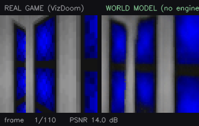
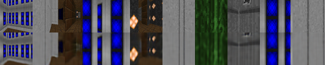

# neural-game-engine

**A game you play inside a neural network.** Train an action-conditioned world
model on Doom, then throw the game engine away and drive the model with your
keyboard. Every pixel below the right-hand label was predicted by a transformer
from the last few frames plus a keypress.



*Left: VizDoom. Right: a 2.0M-parameter transformer predicting the next frame
from the last 6 frames plus the action, at 41 fps on a laptop CPU. Same actions
into both. The PSNR readout is the honest part. Watch it fall as the rollout
feeds on its own output.*

```bash
python play.py
```

## What is actually running

At play time there is no Doom. There is a rolling window of the last few
frames, an action index from the keyboard, and a transformer that predicts the
next frame's tokens. The real game is used for exactly one thing: supplying the
handful of frames that prime the context when you start (and when you press R).

```
   keyboard ─┐
             ▼
  ┌────────────────────────────────────────────────────────┐
  │  last C frames ──► VQ-VAE encoder ──► 64 tokens/frame  │
  │                                            │           │
  │                              dynamics transformer      │
  │                                            │           │
  │                              next frame's 64 tokens    │
  │                                            │           │
  │                          VQ-VAE decoder ──► 64x64 RGB  │
  └────────────────────────────────────────────────────────┘
             ▲                                   │
             └───────────  fed back  ────────────┘
```

The feedback loop is the whole problem. Each predicted frame becomes context
for the next one, so errors compound: the model does not simulate the world, it
samples a plausible continuation of it, and plausible continuations drift.
Sections below measure how fast it drifts and what claws it back.

## Quickstart

```bash
pip install -r requirements.txt
```

Then play the shipped checkpoint. The weights are in `checkpoints/small/` (16 MB), so
this works from a clone with no training and no dataset:

```bash
python play.py
```

Or build the whole thing from scratch (see [reproducing](#reproducing) for timings):

```bash
bash scripts/reproduce.sh configs/small.yaml
```

Controls: `W`/`↑` walk, `A`/`D` turn, hold `W` with a turn to round a corner.
`R` reseeds from the real game, `M` toggles retrieval memory, `TAB` switches
between MaskGIT and raster decoding, `ESC` quits.

## The pipeline

| stage | what it does | entry point |
|---|---|---|
| 1. data | scripted + random policies through VizDoom, `(frame, action)` pairs at 64x64 | `ngx.data.collect` |
| 2. tokenizer | VQ-VAE, 64x64 RGB down to an 8x8 grid of codebook indices | `ngx.train.train_vqvae` |
| 3. dynamics | causal transformer over frame tokens + action embeddings | `ngx.train.train_dynamics` |
| 4. speed | KV cache, MaskGIT parallel decode, bf16, int8 | `ngx.eval.bench` |
| 5. drift | sliding context + retrieval memory, measured | `ngx.eval.drift` |

Final numbers for the shipped checkpoint: tokenizer **28.2 dB** on held-out
frames with 429/512 codes live; dynamics **2.0M params**, val loss 3.20, and
0.152 token accuracy with the entire next frame masked, 78x better than the
1/512 chance rate, and low enough that the world is recognisable rather than
sharp.

The one design decision worth reading about is the sequence layout: two
streams in one sequence, so context stays clean while the target frame is
masked, which is what lets a single set of weights serve both a 64-pass
autoregressive decoder and a 4-pass parallel one with no second training run.
That is in [docs/WRITEUP.md](docs/WRITEUP.md).

## Making it fast

**0.75 fps to 41.3 fps, a 55x speedup**, on an 8-core laptop CPU with no GPU.
Each row adds one change to the fastest configuration so far; a change that
measures slower is reverted and labelled.

| step | fps | ms/frame | passes/frame | vs. row 1 | weights | output delta | |
|---|---|---|---|---|---|---|---|
| raster AR, no KV cache | 0.75 | 1328 | 64 | 1.0x | 8.0 MB | reference | kept |
| + KV cache | 4.68 | 214 | 64 | **6.2x** | 8.0 MB | identical | kept |
| + MaskGIT parallel decode | **41.32** | 24.2 | 4 | **54.9x** | 8.0 MB | 14.8 dB | kept |
| + bf16 autocast | 32.34 | 30.9 | 4 | 43.0x | 8.0 MB | 17.7 dB | reverted |
| + torch.compile | unavailable | | | | | | _no MSVC `cl.exe`_ |
| + int8 dynamic quant | 33.62 | 29.7 | 4 | 44.7x | **0.5 MB** | 17.2 dB | reverted |

Two things in that table are worth more than the headline number.

`identical` on the KV-cache row is not a formatting quirk. It is the proof.
Caching the prefix is supposed to be an *exact* transformation, so under greedy
decoding the cached and uncached rollouts must come out bit-for-bit the same,
and they do. `output delta` compares each row against the configuration its
change was applied to, so it answers "did this change alter the output" rather
than doubling as a quality score.

And two of the four optimisations lost. bf16 and int8 both measure *slower*
than fp32 here: the matmuls are small enough that quantise/dequantise overhead
outruns the arithmetic saved. int8 still cuts weights 16x (8.0 MB to 0.5 MB),
which matters if you are memory-bound rather than compute-bound. This machine
is neither. `torch.compile` cannot run at all without MSVC. The table reports
all of it rather than showing only the three rows that went up and to the right.

Full detail in [docs/BENCHMARKS.md](docs/BENCHMARKS.md), and
[docs/DECODE.md](docs/DECODE.md) for why `maskgit_steps` is 4.

## Fighting drift

A 6-frame context means everything the model knew about a room is gone six
frames after you leave it. Walk out, walk back, and the room gets regenerated
from nothing, usually as a *different* room. The rollout stays plausible while
ceasing to be consistent.

The countermeasure is a retrieval memory keyed on the mean codebook embedding
of each frame, compared by cosine similarity. Retrieved frames **replace the
oldest context slots** rather than extending the context, so the model sees
exactly the block layout it was trained on and needs no retraining, and you can
toggle it mid-game with `M`.

**It does not work at this scale, and the repo says so.** Over 1000 frames on a
single unbroken episode, scored on 40 genuine revisits with a median gap of 507
frames:

| config | return-to-place PSNR | game itself (ceiling) | retrieval fired |
|---|---|---|---|
| sliding context only | **9.89 ± 0.54 dB** | 11.25 dB | 0/1000 frames |
| retrieval memory | **9.20 ± 0.88 dB** | 11.25 dB | 497/1000 frames |

The first version of this evaluation ran one rollout per configuration and
showed memory winning by 0.47 dB. Four seeds showed the win was the seed. The
mechanism works: the correct past frame is the top-ranked match for 55% of
genuine revisits and top-two for ~80%. But a 2.0M-parameter model leans so
hard on the most recent frame that perturbing a distant context slot barely
registers, and the ~45% of retrievals that surface the wrong room cost about
what the right ones gain.

So `memory.enabled` ships as `false`, the feature stays on the `M` key, and
[docs/DRIFT.md](docs/DRIFT.md) has the diagnosis. Note also the *ceiling*: the
real game only scores 11.25 dB against itself at matched poses, because "same
pose" is a tolerance and not an identity. A model number is meaningless without
it.

## Reproducing

Everything below was run on an 8-core laptop CPU (Ryzen 9 8945HS, 32 GB), no
GPU, from a cold checkout:

| step | command | time |
|---|---|---|
| collect 150k frames | `python -m ngx.data.collect --frames 150000 --workers 6` | 1.4 min |
| train tokenizer | `python -m ngx.train.train_vqvae --config configs/small.yaml` | 27 min |
| tokenize dataset | `python -m ngx.data.tokenize --config configs/small.yaml` | 1.3 min |
| train dynamics | `python -m ngx.train.train_dynamics --config configs/small.yaml` | 105 min |

Or all of it at once with `bash scripts/reproduce.sh configs/small.yaml`.

The tokenizer is the part that works well at this scale. 64 discrete tokens
per frame, reconstructed at **28.2 dB** on held-out frames, 429 of 512 codebook
entries in active use. Top row is ground truth, bottom row is a round trip
through the codebook:



`configs/full.yaml` is the scale the design actually targets: 2M frames, a
1024-entry codebook, and a 12-layer 512-wide dynamics model over a 16-frame
context (~38M params). That is roughly a day per stage on one GPU and has not
been run here.

## Repo layout

```
ngx/
  envs/          VizDoom wrappers, discrete action sets, pose (eval only)
  data/          collection, tokenization, datasets
  models/        vqvae.py, dynamics.py
  train/         train_vqvae.py, train_dynamics.py
  infer/         engine.py (KV cache, decoders), memory.py, quantize.py
  eval/          bench.py, drift.py, decode_quality.py
configs/         small.yaml (CPU), full.yaml (one GPU)
checkpoints/     the trained weights play.py loads by default
tests/           train/inference equivalence, cache exactness, memory behaviour
play.py          the demo
```

Training writes to `runs/<name>/`; `play.py` prefers those and falls back to
`checkpoints/<name>/`, so retraining shadows the shipped weights without
overwriting them.

## Tests

```bash
python -m pytest tests/ -q
```

The one that matters is `test_cached_inference_matches_training_forward`:
`play.py` never runs the training forward pass, so if the cached path and the
training path ever disagree, the model you play is not the model you trained,
and the failure is silent, because a subtly wrong world model still produces
plausible-looking Doom.

## Limitations

* **The shipped checkpoint is CPU-scale, and it shows.** 150k frames, a 2.0M
  parameter dynamics model, a 6-frame context, under one pass over the data.
  Expect a recognisable but soft world that drifts within a few hundred frames.
  The pipeline is the artifact; the checkpoint proves it runs end to end.
* **The dynamics config was sized by measurement, not by taste.** On this CPU
  the binding constraint is samples seen rather than parameters, so a 192-wide
  model over a 6-frame context beat a 256-wide model over 8 frames by 2.2x on
  windows-per-second at equal wall clock. On a GPU that trade reverses.
* **`torch.compile` is unavailable here.** Inductor needs MSVC `cl.exe` on
  Windows and it is not installed, so that benchmark row reports the failure
  rather than a number.
* **int8 is CPU-only.** PyTorch's dynamic quantisation lowers to
  fbgemm/qnnpack; the GPU equivalent is a different toolchain and is not
  implemented here.
* **One scenario is wired end to end.** The env wrapper handles five VizDoom
  scenarios; only `my_way_home` has been trained and evaluated.
* **Retrieval is keyed on appearance, not geometry.** Two corridors with the
  same texture and lighting are, to this memory, the same place.

## License

MIT, see [LICENSE](LICENSE).
