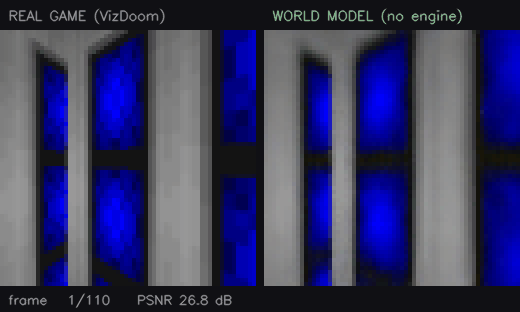

# neural-game-engine

**A game you play inside a neural network.** Train an action-conditioned world
model on Doom, then throw the game engine away and drive the model with your
keyboard. Every pixel on the right was predicted by a transformer from the last
few frames plus a keypress.



*Left: VizDoom. Right: a 25.7M-parameter transformer predicting each frame from
its last 6 frames (6 real ones to start, then its own predictions) plus the same
action, with no game engine running.
PSNR against the real frame is 26.8 dB one frame in, 30.1 dB at frame 8, 16.7 dB
at frame 16 and 9.7 dB at frame 32: it tracks the game for about a dozen frames
and then commits to a continuation of its own. Seed 0, sampled decoding.
Regenerate with `python scripts/make_gif.py --config configs/ladder/26m.yaml
--set name=ladder-26m-t4-s0 dynamics_ckpt=runs/ladder-26m-t4-s0/dynamics/final.pt
--frames 110 --out assets/demo_26m.gif`.*

```bash
python play.py
```

`play.py` runs the 2.0M-parameter checkpoint that ships in `checkpoints/small/`,
which decodes at 35.47 fps on a laptop CPU. The 26M checkpoint in the GIF is a
98 MiB file, past GitHub's 50 MiB recommended size, so it is kept out of the
repo; `configs/ladder/26m.yaml` trains it in about four hours on one RTX 4090.

## What is actually running

At play time there is no Doom. There is a rolling window of the last few
frames, an action index from the keyboard, and a transformer that predicts the
next frame's tokens. The real game is used for exactly one thing: supplying the
handful of frames that prime the context when you start (and when you press R).

```
   keyboard ─┐
             ▼
  ┌────────────────────────────────────────────────────────┐
  │  last C frames ──► VQ-VAE encoder ──► 64 tokens/frame  │
  │                                            │           │
  │                              dynamics transformer      │
  │                                            │           │
  │                              next frame's 64 tokens    │
  │                                            │           │
  │                          VQ-VAE decoder ──► 64x64 RGB  │
  └────────────────────────────────────────────────────────┘
             ▲                                   │
             └───────────  fed back  ────────────┘
```

The feedback loop is the whole problem. Each predicted frame becomes context
for the next one, so errors compound: the model does not simulate the world, it
samples a plausible continuation of it, and plausible continuations drift.

The one design decision worth reading about is the sequence layout: two
streams in one sequence, so context stays clean while the target frame is
masked, which is what lets a single set of weights serve both a 64-pass
autoregressive decoder and a 4-pass parallel one with no second training run.
That is in [docs/WRITEUP.md](docs/WRITEUP.md).

## Scaling ladder

The first checkpoint was a 2.0M-parameter model trained on a laptop CPU for
under one epoch. The question was whether more model would help or whether
something was structurally wrong, so the ladder was pre-registered in
[docs/LADDER_PREREG.md](docs/LADDER_PREREG.md) before any scaled model existed,
with each later amendment dated before the results it touches: capacity (2M, 8M
and 26M, written as 30M in the pre-registration, at a 6-frame context) and
context (6, 12 and 24 frames at 8M), every rung at the same 2.9B-token budget on a 2M-frame dataset, each
scored on its final checkpoint on the same held-out frames by
`python -m ngx.eval.ladder`. Three seeds of the 2M rung put the resolution at
0.08 dB; differences smaller than that are read as no effect.

| rung | params | context | one-step PSNR, moving | headroom | held-out loss | closed-loop lead, k=16 | return-to-place (game) |
|---|---|---|---|---|---|---|---|
| 2M, 3 seeds | 2.0M | 6 | 27.04 to 27.12 dB | 57 to 58% | 2.151 to 2.172 | +1.48 to +2.31 dB | 8.15 to 10.33 dB (12.02) |
| 8M | 7.5M | 6 | 28.23 dB | 70% | 1.660 | +2.48 dB | 9.02 dB (12.02) |
| 26M | 25.7M | 6 | **29.39 dB** | **83%** | **1.202** | **+5.81 dB** | 9.60 dB (12.02) |
| 8M, 12 frames | 7.5M | 12 | 28.63 dB | 75% | 1.578 | +4.01 dB | 12.22 dB (12.02) |
| 8M, 24 frames | 7.5M | 24 | 28.58 dB | 74% | 1.550 | +4.44 dB | 8.68 dB (12.02) |

*Headroom* is the share of the gap between copying the last frame (21.77 dB)
and the tokenizer's own round trip (30.97 dB) that the model closes, on moving
transitions. *Closed-loop lead* is how far the model's own rollout stays ahead
of a frozen frame. *Return-to-place* compares the model's frames at two moments
the player stood in the same spot; the game's own frames score the number in
brackets. Full table, hold-still buckets and the 8M learning-rate probe are in
[docs/LADDER.md](docs/LADDER.md).

What the pre-registered rules said:

* **Rule 1, starved or structural: starved.** Headroom rises at every capacity
  step, 58% to 70% to 83%, and 8M to 26M adds 1.16 dB, about 15 times the
  resolution. The small model was short of capacity and data, not broken.
* **Rule 2, which axis moves which metric: mostly as predicted, with two
  surprises.** Return-to-place is flat in capacity (9.02 dB at 8M and 9.60 dB
  at 26M, both inside the 2M seeds' 8.15 to 10.33 dB) and jumps with context,
  to 12.22 dB at 12 frames, 0.2 dB above the game's own 12.02 dB. So the context axis
  measures what it was built to measure, and the pre-registered wrong-diagnosis
  branch did not fire. At 24 frames it falls back to 8.68 dB. At matched tokens
  that rung saw each training window about once (1.04 epochs), and the ladder
  cannot separate the longer window from the fewer distinct windows, so by the
  pre-registered bound it says only that 8M could not use 24 frames at this
  budget. Not predicted: one-step PSNR also moved with context, by 0.40 dB at
  12 frames, five times the resolution though a third of the 8M-to-26M step;
  and closed-loop lead at k=16 moved with capacity (+2.48 to +5.81 dB) more
  than with context (+2.48 to +4.44 dB), while at k=32 it shrank with context
  (+1.52 to +0.77 dB).
* **Rule 3, stillness: sharper from 8M up, stickier at 2M.** Holding still
  for 2 to 10 frames, the real game keeps the frame identical 79% of the time
  and moves 33 tokens when it moves. The 2M rungs at this budget are stickier:
  87 to 94% identical but only 2 to 4 tokens when they move, changes suppressed
  rather than learned. From 8M up the churn moves toward the reference while the identical rate
  stays inside the 2M seeds' range: 92% and 22 tokens at 8M, 87% and 28 at
  26M, 87 to 89% and 21 to 22 at 12 and 24 frames. Against the CPU checkpoint
  the rule was written for (51% identical, 4 tokens when it moves) both
  numbers are up, the pre-registered sharper branch: fewer, larger,
  settling-sized changes, which is what learning the momentum and view-bob
  decay looks like. Every rung is still
  stiller than the game, and past 10 frames all of them, like the game, stay
  at 100% identical.

The 8M learning rate came from a pre-registered probe. The largest rate tried,
1.68e-3, won even after the one allowed extension, so the best rate may lie
above it, and every rung above 2M ran it (26M at 1.45e-3, scaled for width).

## Making it fast

On a laptop CPU with no GPU, for the 26M checkpoint in the GIF. Each row adds
one change to the fastest configuration so far; a change that measures slower
is reverted and labelled.

| step | fps | ms/frame | passes/frame | vs. row 1 | weights | output delta | |
|---|---|---|---|---|---|---|---|
| raster AR, no KV cache | 0.09 | 10552.2 | 64 | 1.0x | 102.9 MB | reference | kept |
| + KV cache (within frame) | 0.60 | 1659.0 | 64 | 6.4x | 102.9 MB | identical | kept |
| + MaskGIT parallel decode | 5.53 | 180.8 | 4 | 58.4x | 102.9 MB | 13.7 dB | kept |
| + carry KV cache across frames | 7.89 | 126.8 | 4 | 83.2x | 102.9 MB | 16.1 dB | kept |
| + bf16 autocast | 9.34 | 107.1 | 4 | 98.6x | 102.9 MB | 14.2 dB | kept |
| + torch.compile | unavailable | | | | | | _no MSVC `cl.exe`_ |
| + int8 dynamic quant | **10.87** | 92.0 | 4 | **114.7x** | 26.7 MB | 12.1 dB | kept |

`identical` on the KV-cache row is the proof, not a formatting quirk: caching
the prefix is an exact transformation, so under greedy decoding the cached and
uncached rollouts come out bit-for-bit the same. `output delta` compares each
row with the configuration its change was applied to, so it answers "did this
change alter the output" rather than doubling as a quality score. Carrying the
cache across frames is fast but not exact, which is why the engine rebuilds it
at every frame by default.

The same table for the shipped 2M checkpoint goes from 0.65 to 35.47 fps, and
there bf16 and int8 both measure slower than fp32 and are reverted: the
matmuls are small enough that the conversion overhead outruns the arithmetic
saved. Full detail in [docs/BENCHMARKS_26M.md](docs/BENCHMARKS_26M.md) and
[docs/BENCHMARKS.md](docs/BENCHMARKS.md), and [docs/DECODE.md](docs/DECODE.md)
for why `maskgit_steps` is 4 (measured on the 2M checkpoint).

## Fighting drift

A 6-frame context means everything the model knew about a room is gone six
frames after you leave it. Walk out, walk back, and the room gets regenerated
from nothing.

The countermeasure is a retrieval memory keyed on each frame's mean codebook
embedding. Retrieved frames **replace the oldest context slots** rather than
extending the context, so the model sees exactly the block layout it was
trained on and needs no retraining, and you can toggle it mid-game with `M`.

**It does not work on either checkpoint, and the repo says so.** Over 1000 frames
of one unbroken episode, four sampled rollouts per configuration, scored on 40
revisits with a median gap of 507 frames:

| checkpoint | PSNR at k=1 / k=10 | return-to-place, sliding context | with retrieval memory | game (ceiling) |
|---|---|---|---|---|
| 2M, shipped CPU checkpoint | 16.2 / 14.2 dB | 9.89 +/- 0.54 dB | 9.20 +/- 0.88 dB | 11.25 dB |
| 26M ladder rung | 30.5 / 20.6 dB | 11.24 +/- 1.57 dB | 10.60 +/- 0.63 dB | 11.25 dB |

Memory moves return-to-place by -0.69 dB against a run-to-run spread of
+/-1.03 dB on the 2M checkpoint, and by -0.64 dB against +/-1.69 dB at 26M: no
measurable effect either way. The measured weak link is the key. At the 36
revisits where memory held a frame from the same spot, the most similar stored
frame was taken there only 11% of the time, and one of the top two 17% of the
time. Whether the model could use a correct retrieval is untested, and at 26M
sliding context alone already matches the game's own 11.25 dB, which leaves
this metric no room to show a gain. So `memory.enabled` ships as `false`, and
[docs/DRIFT.md](docs/DRIFT.md) and [docs/DRIFT_26M.md](docs/DRIFT_26M.md) have
the numbers.

These drift runs sample from a 6-frame start, where the ladder table decodes
greedily from a 24-frame start so that every context length is scored on the
same frames, which is why the 26M return-to-place numbers differ between the two
tables. The 2M row here is the shipped CPU checkpoint (150k frames, under one
epoch), not the ladder's 2M rung, so the gap between the rows mixes scale with
data and training.

## Reproducing

The CPU pipeline runs on a laptop CPU with no GPU, from a cold checkout, in a
few hours end to end:

| step | command |
|---|---|
| collect 150k frames | `python -m ngx.data.collect --frames 150000 --workers 6` |
| train tokenizer | `python -m ngx.train.train_vqvae --config configs/small.yaml` |
| tokenize dataset | `python -m ngx.data.tokenize --config configs/small.yaml` |
| train dynamics | `python -m ngx.train.train_dynamics --config configs/small.yaml` |

Or all of it at once with `bash scripts/reproduce.sh configs/small.yaml`.
`configs/small.yaml` now trains rotary positions; the shipped checkpoint used
absolute ones, so add `--set dynamics.pos_encoding=absolute` to the dynamics
step to train that exact variant.

The ladder rungs train on one GPU from `configs/ladder/` and share a 2M-frame
dataset, collected once and tokenized with the shipped tokenizer:

```bash
python -m ngx.data.collect --out data/mwh2m --frames 2000000 --workers 8 --seed 100
python -m ngx.data.tokenize --config configs/ladder/26m.yaml
```

Then each rung, for example:

```bash
python -m ngx.train.train_dynamics --config configs/ladder/26m.yaml --resume --set name=ladder-26m-t4-s0 compile=true
python -m ngx.eval.heldout --config configs/ladder/26m.yaml --set name=ladder-26m-t4-s0 --out runs/ladder-26m-t4-s0/heldout.json
python -m ngx.eval.ladder --config configs/ladder/26m.yaml --runs ladder-26m-t4-s0
```

On rented RTX 4090s the 2M rung took 73.5 to 73.6 min per seed, 8M 89.3 min, 26M
240.6 min, and 8M 115.9 min at 12 frames and 168.7 min at 24. Everything above
2M, including the learning-rate probe and two pods that failed with GPU faults,
cost about $9 of GPU rental; the whole ladder about $15.

## Repo layout

```
ngx/
  envs/          VizDoom wrappers, discrete action sets, pose (eval only)
  data/          collection, tokenization, datasets
  models/        vqvae.py, dynamics.py
  train/         train_vqvae.py, train_dynamics.py (token budgets, resume)
  infer/         engine.py (KV cache, decoders), memory.py, quantize.py
  eval/          ladder.py, heldout.py, bench.py, drift.py, baselines.py, ...
configs/         small.yaml (CPU), full.yaml, ladder/ (2m, 8m, 26m, ctx12, ctx24)
checkpoints/     the trained weights play.py loads by default
docs/            LADDER_PREREG.md, LADDER.md, BENCHMARKS*.md, DRIFT*.md, WRITEUP.md
tests/           train/inference equivalence, cache exactness, resume, eval alignment
play.py          the demo
```

Training writes to `runs/<name>/`; `play.py` prefers those and falls back to
`checkpoints/<name>/`, so retraining shadows the shipped weights without
overwriting them.

## Tests

```bash
python -m pytest tests/ -q
```

31 tests, a few seconds on a CPU. The one that matters most is
`test_cached_inference_matches_training_forward`: `play.py` never runs the
training forward pass, so if the cached path and the training path ever
disagree, the model you play is not the model you trained, and the failure is
silent, because a subtly wrong world model still produces plausible-looking
Doom.

## Limitations

* **The shipped checkpoint is the CPU-scale one.** `play.py` runs the 2.0M
  model because the 26M weights are kept out of the repo. It is recognisable
  but soft, and it drifts off the real game within about 50 frames: PSNR falls
  from 16.2 dB at step 1 to 10.6 dB at step 50 ([docs/DRIFT.md](docs/DRIFT.md)).
* **One seed above 2M.** Only the 2M rung was run three times, so the 0.08 dB
  resolution is measured at 2M and assumed at the larger rungs.
* **The context axis ran at 8M.** As pre-registered, a result there speaks for
  8M, not for context in general.
* **The learning rate may be under-tuned upward.** The probe's largest rate won.
* **Return-to-place can beat the game.** It rewards two frames looking alike,
  and a model can draw two similar-looking frames without drawing the right
  room.
* **`torch.compile` is unavailable on this Windows laptop** (Inductor needs
  MSVC `cl.exe`). The 8M, 26M and context rungs trained with `compile=true` on
  the GPU; the 2M rungs ran without it.
* **int8 is CPU-only.** PyTorch's dynamic quantisation lowers to fbgemm or
  qnnpack; the GPU route is a different toolchain and is not implemented.
* **Retrieval is keyed on appearance, not geometry,** and at a revisit its top
  match is usually not from the same spot.
* **One scenario is wired end to end.** The env wrapper handles five VizDoom
  scenarios; only `my_way_home` has been trained and evaluated.

## License

MIT, see [LICENSE](LICENSE).
